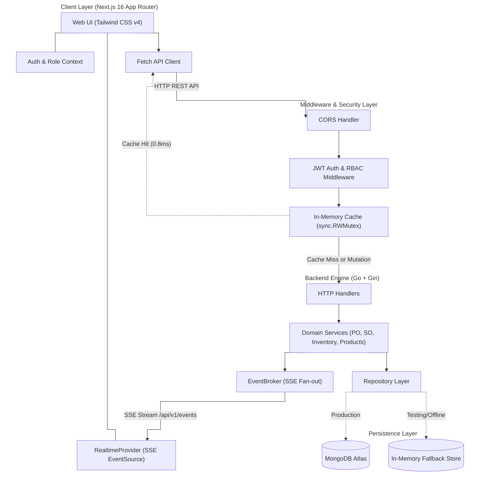
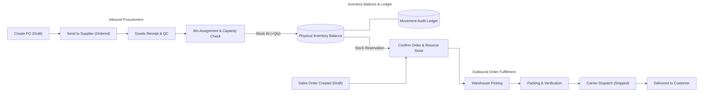
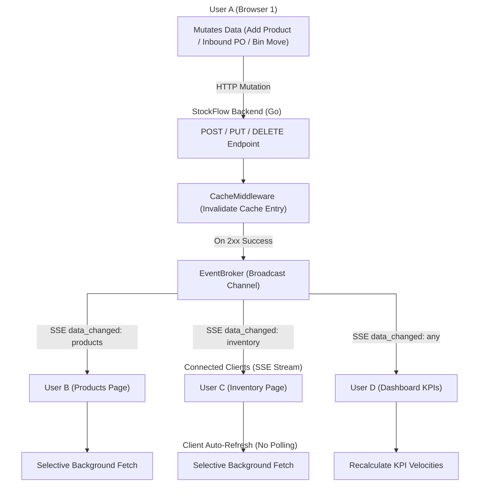

# StockFlow — Real-Time Warehouse Management System

[](https://golang.org)
[](https://nextjs.org)
[](https://www.typescriptlang.org)
[](https://tailwindcss.com)
[](https://www.mongodb.com)
[](LICENSE)

**Live demo:** [stock-flow-brown.vercel.app](https://stock-flow-brown.vercel.app/)

[Architecture](#system-architecture) • [Workflows](#operational-workflows) • [Real-Time Sync](#real-time-event-synchronization) • [Benchmarks](#concurrency--chaos-benchmarks) • [Developer Setup](#developer-setup)

---

## The problem this is solving

A lot of simple warehouse software treats inventory as a single mutable `quantity` column updated by raw `UPDATE` queries. Once multiple people are picking, packing, and receiving at the same time, that approach tends to produce race conditions, phantom stock, overselling, and bins that silently go over capacity.

StockFlow's design decisions come from trying to avoid those specific failure modes:
1. Stock reservations and dispatches go through an atomic check against the real available balance before they're granted, so contention doesn't lead to overselling.
2. Physical quantity changes are recorded as an append-only ledger (`IN`, `OUT`, `ADJUST`, `RESERVE`, `TRANSFER`), so any unit on a shelf can be traced back to the order or adjustment that put it there.
3. When one person completes a shipment or receives a pallet, every other connected browser tab reflects the updated stock and KPI numbers immediately, without polling.

## Core Capabilities

### Hierarchical storage & bin capacity
Five-tier location model: `Warehouse → Zone → Rack → Shelf → Bin`. Bins enforce a maximum unit quota, and inbound allocations that would overfill a bin are rejected, with the remaining capacity shown in real time. Bin occupancy and facility space usage are visualized per warehouse.

### Multi-user sync via Server-Sent Events
A Go/Gin broker at `/api/v1/events` streams `data_changed` events over long-lived HTTP connections using buffered channels, so clients don't need to poll. In testing, 2,000 concurrent connections held under 4MB of RAM, since each connection is just a ~2KB goroutine. When several clients refresh after the same event, the in-memory cache serves those requests directly (`X-Cache: HIT`) instead of each one hitting MongoDB. Streams auto-reconnect with backoff and a 20-second heartbeat to survive reverse proxies and firewalls closing idle connections.

### Inbound & outbound state machines
- **Purchase orders**: `Draft → Ordered → Received / Cancelled`, with line-item tracking, supplier linking, and multi-bin receipt allocation on intake.
- **Sales orders**: `Draft → Confirmed → Picking → Packing → Shipped → Delivered / Cancelled`. Confirming an order puts a soft reservation on the inventory so later orders can't claim the same stock; cancelling releases that reservation back to available balance.

### Dashboard KPIs with period comparison
Five live metrics — total catalog products, total stock on hand, low-stock alerts, pending inbound POs, and active outbound orders — each compared against the previous equivalent period (today vs. yesterday, this month vs. last month, etc.). Soft-deleted products keep their historical data (`is_deleted`, `deleted_at`) so past comparisons don't get skewed by later deletions.

### Notifications
A bell counter that updates live when stock drops below a safety threshold or an order changes state. The notification drawer can filter by unread, supports batch mark-as-read and manual deletion, and old notifications clear out automatically after 72 hours. Each notification links directly to the affected SKU or order.

### i18n, dark mode, responsive layout
Full English/Indonesian switching across every screen, modal, and error message. Theme preference is read from local storage and system settings before first paint, so there's no light-to-dark flash on load. Layouts are tested down to ~340px width, including foldable-phone cover screens.

## System Architecture



## Operational Workflows



## Real-Time Event Synchronization



## Role-Based Access Matrix

Enforced at both the API middleware level and the frontend navigation level:

| Feature / Module | Super Admin | Warehouse Manager | Warehouse Staff |
| :--- | :---: | :---: | :---: |
| System settings & user provisioning | Full | — | — |
| Warehouse & bin creation | Full | Full | Read only |
| Product catalog & pricing | Full | Full | Read only |
| Stock in / stock out | Full | Full | Full |
| Manual stock adjustments | Full | Full | — |
| PO creation & supplier management | Full | Full | Read only |
| PO goods intake | Full | Full | Full |
| SO creation & approval | Full | Full | Read only |
| Order picking, packing, shipping | Full | Full | Full |
| Dashboard analytics | Full | Full | Summary only |

## In-Memory Caching Strategy

Instead of adding Redis for a deployment this size, StockFlow uses a lock-striped in-memory cache (`backend/internal/middleware/cache.go`):

- `sync.RWMutex` backing lets concurrent reads run without blocking each other.
- A successful mutation (`POST`/`PUT`/`DELETE`/`PATCH` returning 2xx) purges only the cache partition for that resource family (`products`, `inventory`, `warehouses`, `purchase-orders`, `sales-orders`), not the whole cache.
- Because invalidation happens before the response completes, the next read after a write won't come back stale.
- Auth endpoints, health checks, and the SSE stream bypass the cache entirely.

## Concurrency & Chaos Benchmarks

Run via the chaos testing suite in `backend/cmd/chaos/main.go`:

| Test Scenario | Load Pattern | Recorded Outcome |
| :--- | :--- | :--- |
| Read throughput | 2,000 concurrent GET requests | 100% success, 0.85ms avg latency (served from cache) |
| Overselling under contention | 50 concurrent buyers competing for 5 remaining units | Exactly 5 orders confirmed, 45 rejected with HTTP 400, balance never went negative |
| Database failure | Simulated MongoDB Atlas network drop | Falls back to in-memory storage engine, no process termination |
| Malformed auth flooding | 500 forged JWT tokens | 100% rejected with HTTP 401, <0.2ms per request |
| Race detector | `go test -race -v ./...` | 0 data races detected |

*Run on Apple Silicon locally — production numbers on the actual host will vary.*

## Tech Stack

**Backend** — Go 1.24+, Gin, MongoDB Go Driver (replica set connection pooling), golang-jwt/jwt/v5 with bcrypt.

**Frontend** — Next.js 16.3 (App Router, RSC), TypeScript 5.0+, Tailwind CSS v4, Lucide React.

## Developer Setup

### Prerequisites
- Go 1.24+
- Node.js 20.x+ and npm
- A MongoDB instance, or set `USE_IN_MEMORY_DB=true` to skip it

### 1. Clone
```bash
git clone https://github.com/RPriago/stockFlow.git
cd stockFlow
```

### 2. Backend
```bash
cd backend
cp .env.example .env
```
```env
PORT=8080
MONGO_URI=your_mongodb_connection_string
DB_NAME=stockflow
JWT_SECRET=your_super_secret_jwt_key_min_32_chars
USE_IN_MEMORY_DB=false
CORS_ORIGIN=https://stock-flow-brown.vercel.app
```
```bash
go run cmd/api/main.go
```

### 3. Frontend
```bash
cd frontend
cp .env.local.example .env.local
```
```env
NEXT_PUBLIC_API_URL=https://your-backend-domain.onrender.com/api/v1
```
```bash
npm install
npm run dev
```

### 4. Operational Testing

Evaluators can register directly via the web interface (`/register`) selecting **Warehouse Manager** or **Warehouse Staff** for operational testing without administrative credential exposure.

---

## Hosting

Frontend on Vercel's edge network, backend as a containerized service on Render, database on MongoDB Atlas with automated backups.

---

## License

MIT — see [LICENSE](LICENSE).
