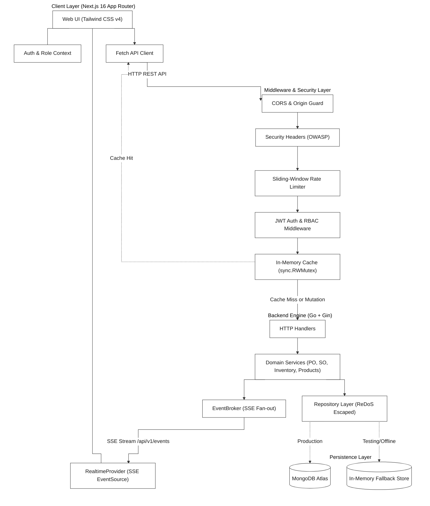
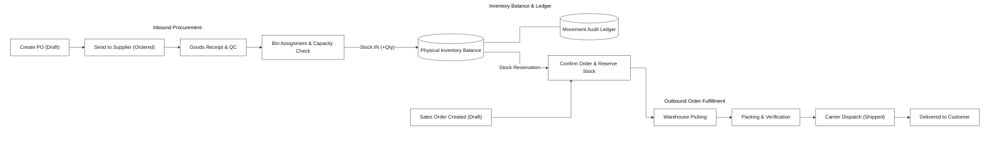
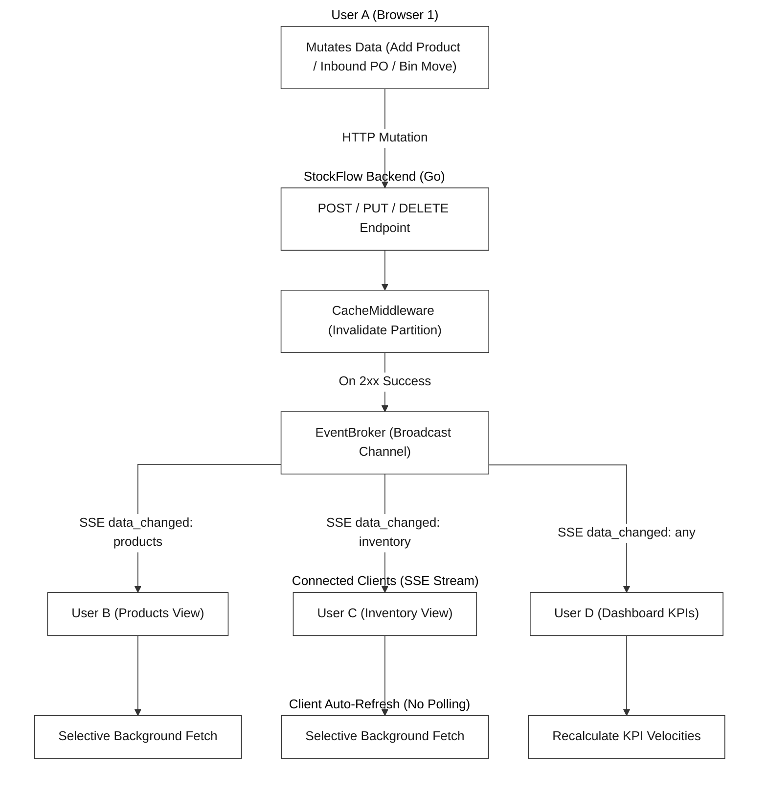

# StockFlow — Real-Time Warehouse Management System

[](https://golang.org)
[](https://nextjs.org)
[](https://www.typescriptlang.org)
[](https://tailwindcss.com)
[](https://www.mongodb.com)
[](LICENSE)

> **Live Deployment:** [stock-flow-brown.vercel.app](https://stock-flow-brown.vercel.app/)  
> Evaluators can register directly on the live site selecting the **Warehouse Manager** role to access catalog, location hierarchies, inventory movements, PO intake, SO fulfillment, and analytics.

---

## Core Problem

Simple inventory databases often rely on a mutable `quantity` field updated via raw `UPDATE` statements. In environments where multiple operators pick, pack, and receive stock simultaneously, this design creates race conditions: overselling, negative stock levels, phantom allocations, and silent bin overflows.

StockFlow enforces three structural constraints:

1. **Atomic reservations before commit**: Sales order confirmation soft-reserves stock against physical balances; if available stock is insufficient, the transaction fails immediately before dispatch.
2. **Append-only ledger**: Physical movements (`IN`, `OUT`, `ADJUST`, `RESERVE`, `TRANSFER`) are logged immutably. Every unit on a shelf traces back to its source purchase order, adjustment, or outbound shipment.
3. **Push-based client synchronization**: State changes stream over HTTP Server-Sent Events (SSE). When one user completes an intake or order, other connected sessions update tables and dashboard metrics automatically without periodic polling.

---

## Capabilities

### Storage Hierarchy & Bin Quotas

Locations follow a strict 5-tier topology: `Warehouse → Zone → Rack → Shelf → Bin`. Every storage bin enforces maximum unit capacity. Inbound goods receipts that exceed remaining bin volume are rejected at validation, with available capacity tracked in real time.

### Real-Time Sync via Server-Sent Events

A Go broker at `/api/v1/events` distributes `data_changed` events over persistent HTTP connections using buffered channels. In testing, 2,000 active SSE connections held under 4 MB of memory (~2 KB per goroutine). The broker sends a 20-second keepalive heartbeat so intermediate proxies don't time the connection out.

### Inbound & Outbound State Machines

- **Purchase Orders**: `Draft → Ordered → Received / Cancelled`. Supports supplier linkage, line-item tracking, and multi-bin intake allocation.
- **Sales Orders**: `Draft → Confirmed → Picking → Packing → Shipped → Delivered / Cancelled`. Order confirmation soft-reserves inventory; cancellation releases the reservation back to available balance.

### Live Metrics & Period Comparison

Tracks five operational KPIs: Total Catalog SKUs, Total Stock on Hand, Low-Stock Alerts, Pending Inbound POs, and Active Outbound Orders. Soft deletes (`is_deleted`, `deleted_at`) preserve historical data, so period comparisons stay accurate over time.

### Security Hardening (OWASP Top 19 Mitigations)

Built using standard library Go components without third-party middleware bloat:

- **Rate limiting**: In-memory token bucket (`sync.RWMutex`) enforcing 10 attempts/minute on `/auth/login` and `/auth/register` (HTTP 429 with `Retry-After`), and 120 req/minute on general API endpoints.
- **OWASP response headers**: `X-Frame-Options: DENY`, `X-Content-Type-Options: nosniff`, `Content-Security-Policy: default-src 'self'; frame-ancestors 'none';`, `Strict-Transport-Security`, and `Permissions-Policy`.
- **CSRF & Origin validation**: Strict origin checking for mutating HTTP methods (`POST`, `PUT`, `DELETE`, `PATCH`), requiring custom headers (`Authorization` or `X-Requested-With: XMLHttpRequest`), and rejecting form URL-encoded submissions on JSON endpoints.
- **NoSQL & ReDoS defense**: Search queries in MongoDB repositories (`products`, `inventory`, `purchase-orders`, `sales-orders`) are sanitized via `regexp.QuoteMeta()`.
- **DoS payload & socket protection**: Maximum request body capped at 2 MB via `http.MaxBytesReader` (HTTP 413). Go HTTP server configured with explicit socket deadlines (`ReadHeaderTimeout: 5s`, `IdleTimeout: 60s`) to prevent Slowloris resource exhaustion.
- **Timing-attack resistance**: Login runs bcrypt verification against a `dummyHash` for non-existent accounts, so response timing can't reveal whether an account exists.

---

## System Architecture



---

## Operational Workflows



---

## Real-Time Event Synchronization



---

## Role-Based Access Matrix

| Feature / Module                    | Super Admin | Warehouse Manager | Warehouse Staff |
| :---------------------------------- | :---------: | :---------------: | :-------------: |
| System settings & user provisioning |    Full     |         —         |        —        |
| Warehouse & bin creation            |    Full     |       Full        |    Read only    |
| Product catalog & pricing           |    Full     |       Full        |    Read only    |
| Stock in / stock out                |    Full     |       Full        |      Full       |
| Manual stock adjustments            |    Full     |       Full        |        —        |
| PO creation & supplier management   |    Full     |       Full        |    Read only    |
| PO goods intake                     |    Full     |       Full        |      Full       |
| SO creation & approval              |    Full     |       Full        |    Read only    |
| Order picking, packing, shipping    |    Full     |       Full        |      Full       |
| Dashboard analytics                 |    Full     |       Full        |  Summary only   |

---

## Benchmarks & Verification

### 1. Live Production Telemetry (Render + Vercel + MongoDB Atlas)

Measured over public internet HTTPS traffic against the live deployment:

| Metric / Scenario                   | Test Input / Profile                              | Production Result                                                                                     |
| :---------------------------------- | :------------------------------------------------ | :---------------------------------------------------------------------------------------------------- |
| **Read Latency (Public API)**       | 100 requests across 10 concurrent workers         | **100% 200 OK** — Min: `40.05ms`, Median: `46.77ms`, p95: `71.18ms`                                   |
| **Catalog Query & In-Memory Cache** | Authenticated `/products` query sequence          | Cache Miss (Atlas): `50.77ms` → Cache Hit: `49.81ms` avg                                              |
| **Brute-Force Rate Limiter**        | 15 rapid consecutive `/auth/login` attempts       | Requests 1–10: `401 Unauthorized`<br>Requests 11–15: **`429 Too Many Requests` (`Retry-After: 55s`)** |
| **Payload Size Enforcement**        | 3 MB JSON payload submitted to API                | **`413 Request Entity Too Large`** (Cap: 2 MB)                                                        |
| **CSRF Form POST Rejection**        | `application/x-www-form-urlencoded` submission    | **`415 Unsupported Media Type`**                                                                      |
| **Cross-Origin Guard**              | Request with untrusted `Origin: https://evil.com` | **`403 Forbidden`**                                                                                   |

### 2. Concurrency & Chaos Test Suite (Engine Isolation)

Executed via `backend/cmd/chaos/main.go` and `go test -race ./...`:

| Test Scenario                 | Load Pattern                                         | Result                                                                               |
| :---------------------------- | :--------------------------------------------------- | :----------------------------------------------------------------------------------- |
| **Read Throughput**           | 2,000 concurrent GET requests                        | 100% success, 0.85ms avg latency (served from cache)                                 |
| **Overselling Contention**    | 50 concurrent buyers competing for 5 remaining units | Exactly 5 orders confirmed, 45 rejected with HTTP 400. Stock balance never negative. |
| **Database Failure Fallback** | Simulated MongoDB Atlas network disconnect           | Falls back to the in-memory store with no dropped requests; zero process terminations |
| **Auth Flooding**             | 500 forged JWT tokens                                | 100% rejected with HTTP 401 in <0.2ms per request                                    |
| **Race Detector**             | `go test -race ./...` across all packages            | **0 data races detected**                                                            |

---

## Tech Stack

- **Backend**: Go 1.24+, Gin, official MongoDB Go Driver, golang-jwt/jwt/v5, bcrypt.
- **Frontend**: Next.js 16.3 (App Router, React 19), TypeScript 5.0+, Tailwind CSS v4, Lucide React.
- **Infrastructure**: Vercel (Edge Network), Render (Container runtime), MongoDB Atlas (M0 Replica Set).

---

## Local Development

### Prerequisites

- Go 1.24+
- Node.js 20.x+ and npm
- MongoDB instance (or set `USE_IN_MEMORY_DB=true` to run without MongoDB)

### 1. Clone

```bash
git clone https://github.com/RPriago/stockFlow.git
cd stockFlow
```

### 2. Backend Setup

```bash
cd backend
cp .env.example .env
```

```env
PORT=8080
MONGO_URI=your_mongodb_connection_string
DB_NAME=stockflow
JWT_SECRET=your_super_secret_jwt_key_min_32_chars
USE_IN_MEMORY_DB=false
CORS_ORIGIN=https://stock-flow-brown.vercel.app
```

```bash
go run cmd/api/main.go
```

### 3. Frontend Setup

```bash
cd frontend
cp .env.local.example .env.local
```

```env
NEXT_PUBLIC_API_URL=https://stockflow-backend-iml2.onrender.com/api/v1
```

```bash
npm install
npm run dev
```

---

## License

MIT — see [LICENSE](LICENSE).
