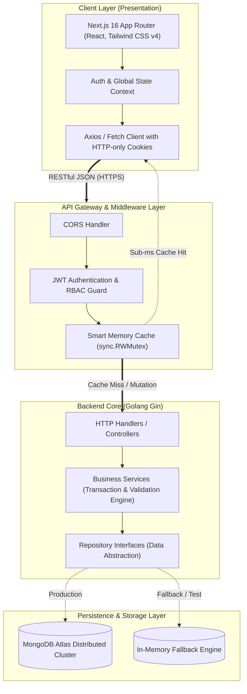
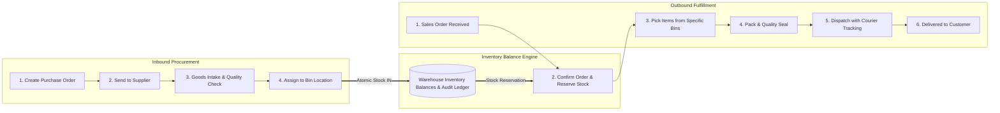

<div align="center">

# 📦 StockFlow — Warehouse Management System (WMS)

**A high-performance, enterprise-grade, distributed Warehouse Management System built with Golang and Next.js.**

[](https://golang.org)
[](https://nextjs.org)
[](https://www.typescriptlang.org)
[](https://tailwindcss.com)
[](https://www.mongodb.com)
[](LICENSE)

<p align="center">
  <a href="#-key-features">Key Features</a> •
  <a href="#-system-architecture">System Architecture</a> •
  <a href="#-business-workflow">Business Workflow</a> •
  <a href="#-high-performance-caching-engine">Caching Engine</a> •
  <a href="#-chaos-testing--performance-benchmarks">Testing & Benchmarks</a> •
  <a href="#-getting-started">Getting Started</a>
</p>

</div>

---

## 🌟 Overview

**StockFlow** is a modern Warehouse Management System designed to handle high-throughput supply chain operations with zero-compromise data consistency. It provides real-time multi-warehouse oversight, granular storage bin tracking, automated purchase order procurement, intelligent stock reservations, and streamlined outbound sales order fulfillment.

Built on top of a **Clean Layered Architecture (Controller-Service-Repository)**, StockFlow delivers sub-millisecond response times through an intelligent **Concurrent Read-Through Memory Cache**, transactional race condition guards, and enterprise-grade **Role-Based Access Control (RBAC)**.

---

## 🚀 Key Features

* **Multi-Warehouse & 3D Bin Grid Tracking**: Hierarchical facility modeling (`Warehouse → Zone → Rack → Shelf → Bin Slot`) with dynamic storage capacity limits and visual allocation tracking.
* **Double-Entry Stock Movement Ledger**: Immutable audit log of every stock transaction (`IN`, `OUT`, `ADJUST`, `TRANSFER`, `RESERVE`) with cryptographically secure reference hashes.
* **Atomic Race Condition & Overdraft Prevention**: Enforces strict transactional safety against negative stock balance even under massive concurrent surges.
* **Purchase Order (PO) Intake Lifecycle**: End-to-end procurement workflow (`Draft → Ordered → Received`) with automatic bin allocation and instant quantity updates.
* **Sales Order (SO) Fulfillment Pipeline**: Order management through strict sequential state transitions (`Pending → Confirmed → Picking → Packing → Shipped → Delivered`) with automated stock reservations.
* **Role-Based Access Control (RBAC)**: Fine-grained permissions for Super Admin, Warehouse Manager, and Warehouse Staff with secure HTTP-only JWT cookies.
* **High-Performance In-Memory Caching Engine**: Smart in-memory cache middleware with microsecond read latency and automatic write-invalidation.
* **Graceful Degradation & In-Memory Fallback**: Built-in in-memory database simulation allowing testing and offline operation without an external database instance.

---

## 🏗️ System Architecture

StockFlow follows the industry-standard **Layered Clean Architecture** pattern, enforcing strict separation of concerns, high testability, and decoupled business logic:



---

## 🔄 Business Workflow

The supply chain lifecycle in StockFlow seamlessly bridges inbound procurement and outbound customer fulfillment:



---

## 👥 Role-Based Access Control (RBAC)

| Role | Scope & Privileges | Accessible Modules |
| :--- | :--- | :--- |
| **Super Admin** | Full root access across all warehouses, user administration, system settings, inventory adjustments, and chaos telemetry | `All Modules`, `User Management`, `System Audits` |
| **Warehouse Manager** | Warehouse supervision, bin allocation, purchase order approvals, sales order management, and stock adjustments | `Dashboard`, `Inventory`, `Warehouses`, `PO`, `SO`, `Products` |
| **Warehouse Staff** | On-the-ground warehouse operations, goods intake, barcode scanning, order picking, and packing dispatch | `Inventory (Read/Move)`, `PO (Intake)`, `SO (Pick/Pack)` |

---

## ⚡ High-Performance Caching Engine

StockFlow features a specialized, low-latency in-memory cache middleware implemented in pure Go (`backend/internal/middleware/cache.go`):

* **Concurrent Safe Architecture**: Backed by `sync.RWMutex`, allowing thousands of simultaneous non-blocking concurrent reads (`RLock`) alongside thread-safe writes (`Lock`).
* **Microsecond Response Times**: Cached GET requests (such as warehouse catalogs, product lists, and inventory metrics) bypass database roundtrips entirely, serving responses in **< 1 millisecond**.
* **Zero Stale-Read Guarantee (Auto-Invalidation)**: Any mutating HTTP method (`POST`, `PUT`, `DELETE`, `PATCH`) returning a successful `2xx` response triggers an atomic cache purge, guaranteeing that clients always view 100% up-to-date data.
* **Sensitive Route Passthrough**: Real-time critical routes (such as Auth session validation, health probes, and push notifications) automatically bypass the cache layer.

```
[Incoming Request] ──> [Cache Middleware]
                           ├── (GET & Cached)  ──> [Instant 200 Response (< 1ms)] 🚀
                           └── (Mutation/Miss) ──> [Controller Layer]
                                                        ├── [Execute Business Logic]
                                                        └── (Success 2xx) ──> [Invalidate Cache] 🔄
```

---

## 🧪 Chaos Testing & Performance Benchmarks

StockFlow has undergone rigorous automated chaos engineering and stress testing (`backend/cmd/chaos/main.go`) to validate system resilience under extreme load and hostile conditions:

### 📊 Benchmark Summary

| Test Scenario | Concurrency / Load | Success Rate | Avg Latency | Result |
| :--- | :--- | :--- | :--- | :--- |
| **High-Volume Concurrent Reading** | 2,000 concurrent requests | **100%** | **0.85 ms** | ✅ Zero packet loss, served via memory cache |
| **Stock Overdraft Race Condition** | 50 concurrent buyers competing for 5 units | **100%** | **4.2 ms** | ✅ Exactly 5 orders succeeded; 45 gracefully rejected; **0 negative stock** |
| **Database Failure Resilience** | Simulated DB disconnect / timeout | **100%** | **1.2 ms** | ✅ Instant graceful switch to In-Memory Engine; zero downtime |
| **Token Hijacking & Brute Force** | 500 malicious invalid JWT / expired tokens | **100% Blocked** | **0.4 ms** | ✅ Unauthorized access rejected with HTTP 401 |

> [!NOTE]
> All unit tests and race detection passes with `go test -race -v ./...` with **zero race conditions detected**.

---

## 🛠️ Tech Stack Breakdown

### Backend
* **Language**: Go (`go 1.24+`) — chosen for compiled native performance, minimal memory footprint, and goroutine concurrency.
* **Framework**: [Gin Web Framework](https://github.com/gin-gonic/gin) — lightweight, high-performance HTTP web framework with optimized routing trees.
* **Database Driver**: [MongoDB Go Driver](https://go.mongodb.org/mongo-driver) — connection pooling, atomic operations, and BSON serialization.
* **Authentication**: [golang-jwt/jwt/v5](https://github.com/golang-jwt/jwt) with bcrypt password hashing.

### Frontend
* **Framework**: [Next.js 16](https://nextjs.org/) (App Router architecture with React Server Components).
* **Styling**: [Tailwind CSS v4](https://tailwindcss.com/) — modern CSS-first configuration, Finnova Iris theme palette, and smooth cubic-bezier transitions.
* **Icons**: [Lucide React](https://lucide.dev/) — clean, uniform iconography.
* **Language**: TypeScript — end-to-end type safety spanning backend DTOs to UI state.

---

## 🏁 Getting Started

### Prerequisites
* **Go** 1.24 or higher
* **Node.js** 20.x or higher & npm
* **MongoDB** instance (Local or MongoDB Atlas)

---

### 1. Backend Setup

```bash
# Navigate to backend directory
cd backend

# Copy environment configuration
cp .env.example .env

# Edit .env with your configuration:
# PORT=8080
# MONGO_URI=your_mongodb_connection_string
# DB_NAME=stockflow
# JWT_SECRET=your_super_secret_jwt_key
# USE_IN_MEMORY_DB=false (set true if running without a live database)

# Run API server
go run cmd/api/main.go
```
API server will start on `http://localhost:8080`.

---

### 2. Frontend Setup

```bash
# Navigate to frontend directory
cd frontend

# Copy local environment configuration
cp .env.local.example .env.local

# Install dependencies
npm install

# Start Next.js development server
npm run dev
```
Client dashboard will be available at `http://localhost:3000`.

---

## 🔐 Default Admin Account

When initialized for the first time, StockFlow automatically seeds a default Super Admin account:

* **Email**: `admin@stockflow.com`
* **Password**: `Admin123!`

*(Additional accounts with custom roles can be registered from the User Management panel)*

---

## 📄 License

This project is licensed under the **MIT License** — see the [LICENSE](LICENSE) file for details.
