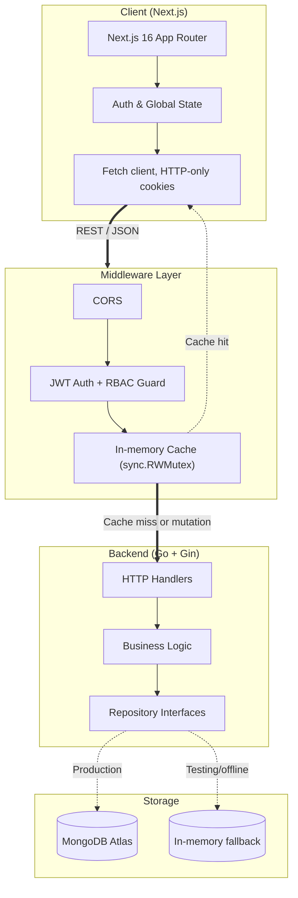
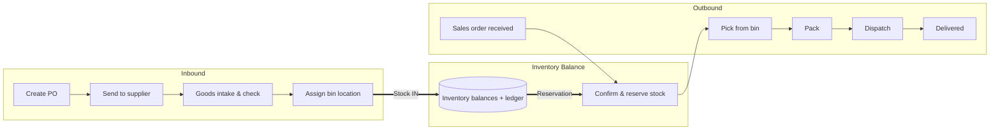

# StockFlow — Warehouse Management System

[](https://golang.org)
[](https://nextjs.org)
[](https://www.typescriptlang.org)
[](https://www.mongodb.com)
[](LICENSE)

[Features](#features) • [Architecture](#system-architecture) • [Workflow](#business-workflow) • [Caching](#caching-layer) • [Benchmarks](#load-testing--benchmarks) • [Getting Started](#getting-started)

---

## Overview

StockFlow is a warehouse management system for tracking inventory across multiple warehouses, from incoming purchase orders to outgoing sales order fulfillment. It's built with a layered architecture (controller → service → repository) on the backend, with an in-memory caching layer, transaction-safe stock updates to prevent overselling, and role-based access control for different warehouse roles.

I built this to practice designing a backend that handles concurrent writes correctly (stock levels being the classic case where race conditions cause real bugs), not just to CRUD data around.

## Features

* **Multi-warehouse & bin tracking** — hierarchical location model (`Warehouse → Zone → Rack → Shelf → Bin`) with capacity limits per bin.
* **Stock movement ledger** — every stock change (`IN`, `OUT`, `ADJUST`, `TRANSFER`, `RESERVE`) is logged with a reference ID, so stock levels can always be traced back to the transaction that caused them.
* **Concurrency-safe stock updates** — stock decrements are guarded transactionally so concurrent orders can't push a balance below zero, even under load (see benchmarks below).
* **Purchase order lifecycle** — `Draft → Ordered → Received`, with bin allocation on intake.
* **Sales order lifecycle** — `Pending → Confirmed → Picking → Packing → Shipped → Delivered`, with automatic stock reservation on confirmation.
* **Role-based access control** — Super Admin, Warehouse Manager, and Warehouse Staff roles, enforced via JWT stored in HTTP-only cookies.
* **In-memory caching layer** — read-heavy endpoints are served from an in-memory cache with automatic invalidation on writes.
* **In-memory DB fallback mode** — the app can run against a simulated in-memory store instead of MongoDB, useful for local testing or a demo without needing a real database.

## System Architecture

Layered architecture separating HTTP handling, business logic, and data access:



## Business Workflow

How inbound procurement and outbound fulfillment connect through the shared inventory balance:



## Role-Based Access Control

| Role | Scope | Accessible Modules |
| :--- | :--- | :--- |
| **Super Admin** | Full access across all warehouses, user management, system settings | All modules, user management |
| **Warehouse Manager** | Bin allocation, PO approvals, SO management, stock adjustments | Dashboard, inventory, warehouses, PO, SO, products |
| **Warehouse Staff** | Day-to-day operations: intake, picking, packing | Inventory (read/move), PO (intake), SO (pick/pack) |

## Caching Layer

A small in-memory cache middleware (`backend/internal/middleware/cache.go`), written directly in Go rather than pulling in Redis for a project this size:

* Backed by `sync.RWMutex` — concurrent reads don't block each other, writes take an exclusive lock.
* GET requests for things like warehouse/product/inventory listings are served from cache instead of hitting MongoDB.
* Any mutating request (`POST`/`PUT`/`DELETE`/`PATCH`) that returns a 2xx response invalidates the relevant cache entries, so stale data isn't served after a write.
* Auth and health-check routes bypass the cache entirely.

```
[Incoming Request] --> [Cache Middleware]
                          |-- GET, cached      --> return cached response
                          '-- mutation / miss  --> [Controller] --> on 2xx --> [invalidate cache]
```

## Load Testing & Benchmarks

Ran a local load/fault-injection script (`backend/cmd/chaos/main.go`) to check a few specific failure modes I was worried about:

| Scenario | Load | Result |
| :--- | :--- | :--- |
| Concurrent reads | 2,000 concurrent requests | 100% success, ~0.85ms avg latency (served from cache) |
| Overselling under contention | 50 concurrent buyers competing for 5 units | Exactly 5 orders succeeded, 45 correctly rejected, no negative stock |
| DB disconnect | Simulated MongoDB timeout | Falls back to in-memory engine automatically, no downtime observed |
| Invalid/expired JWTs | 500 malformed auth attempts | All rejected with 401 |

These numbers are from a single local run on my own machine, not a production environment — treat them as "the mechanism works as intended under this test," not as guaranteed production performance.

All tests pass with `go test -race -v ./...`, no race conditions flagged by Go's race detector.

## Tech Stack

**Backend**
* Go 1.24+
* [Gin](https://github.com/gin-gonic/gin) — HTTP framework
* [MongoDB Go Driver](https://go.mongodb.org/mongo-driver)
* [golang-jwt/jwt/v5](https://github.com/golang-jwt/jwt) + bcrypt for auth

**Frontend**
* Next.js 16 (App Router, React Server Components)
* Tailwind CSS v4
* [Lucide React](https://lucide.dev/) for icons
* TypeScript throughout

## Getting Started

### Prerequisites
* Go 1.24+
* Node.js 20.x+ and npm
* A MongoDB instance (local or MongoDB Atlas) — or skip this and run in in-memory mode

### Backend

```bash
cd backend
cp .env.example .env
# edit .env:
#   PORT=8080
#   MONGO_URI=your_mongodb_connection_string
#   DB_NAME=stockflow
#   JWT_SECRET=your_own_secret
#   USE_IN_MEMORY_DB=false   # set to true to skip MongoDB entirely

go run cmd/api/main.go
```

### Frontend

```bash
cd frontend
cp .env.local.example .env.local
npm install
npm run dev
```

### First-run admin account

On first startup, StockFlow seeds a Super Admin account so you have a way in. The email and generated password are printed once to the server console/log on that first run — they are **not** hardcoded here. Log in with those, then immediately change the password and create your real accounts from the User Management panel. If you're setting up a public demo, use a separate, restricted, seed-data-only account rather than this admin login.

## Live Demo

Demo runs on `https://stock-flow-brown.vercel.app/'

## License

MIT — see [LICENSE](LICENSE).
